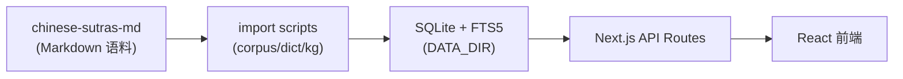

# 静心 JINGXIN

> 让佛经更容易读懂 — 现代化佛经阅读与理解平台

**静心（JINGXIN）** 帮助普通读者与初学者更容易读懂汉传佛经：无需注册即可搜索、阅读、查辞典、浏览知识图谱，并可选用 AI 辅助理解。本仓库为**应用代码**；经藏正文语料在独立仓库 [`chinese-sutras-md`](https://github.com/daichangya/chinese-sutras-md) 中维护。

---

## 功能

- **经文阅读** — 沉浸阅读、目录导航、划选查词、阅读偏好与进度
- **统一搜索** — 经目、段落、辞典词条、人物跨源检索
- **经藏浏览** — 按 CBETA 部类浏览已导入经典
- **佛学辞典** — 多源辞典聚合查询（DILA、佛光大辞典等）
- **AI 对话** — 基于经文的 RAG 问答（需配置 AI Gateway）
- **知识图谱** — 人物、经典、关系可视化与时间线
- **佛教地理** — 圣地与寺院地图（需 MapTiler Key）
- **抄经字帖** — 生成字帖并导出 PNG / PDF
- **平行对读** — 左右栏对比不同版本段落
- **分享与经句** — 经文片段分享卡片、今日经句

详细路由与操作说明见 [读者使用手册](docs/user-guide/README.md)。

---

## 技术栈

Next.js · React · TypeScript · SQLite（better-sqlite3）· Drizzle ORM · FTS5 · CBETA

可视化：D3、deck.gl · UI：Radix UI · 测试：Vitest、Playwright

---

## 相关仓库

| 仓库 | 说明 |
|------|------|
| [`daichangya/chinese-sutras-site`](https://github.com/daichangya/chinese-sutras-site) | **本仓库** — Web 应用与数据导入脚本 |
| [`daichangya/chinese-sutras-md`](https://github.com/daichangya/chinese-sutras-md) | 语料真相源（Markdown），需单独 clone |
| [`cbeta-org/xml-p5`](https://github.com/cbeta-org/xml-p5) | 可选 — 从 CBETA XML 重新生成语料（开发机） |

> **注意**：clone 本仓库后**不会**自带经藏正文，需按下方步骤导入 `chinese-sutras-md` 或使用演示种子数据。

---

## 快速开始

### 前置要求

- Node.js 22 LTS
- npm

### Clone 与安装

```bash
git clone git@github.com:daichangya/chinese-sutras-site.git
cd chinese-sutras-site
npm install
cp .env.example .env   # 按需填写 AI Gateway、地图 Key 等
```

### 完整开发环境（含经藏）

```bash
git clone git@github.com:daichangya/chinese-sutras-md.git chinese-sutras-md
npm run db:migrate
npm run corpus:import          # 从 chinese-sutras-md 入库
npm run seed:topics
npm run seed:daily
npm run dev
```

VPS 低内存部署可使用 `npm run corpus:import -- --md-only`。

### 本地演示（无需语料）

```bash
npm run db:migrate
npm run seed:demo
npm run dev
```

### 从 CBETA XML 重新生成语料（可选，开发机）

```bash
git clone --depth 1 https://github.com/cbeta-org/xml-p5.git vendor/xml-p5
npm run corpus:gen             # 默认读取 vendor/xml-p5
npm run corpus:import
```

---

## 环境变量

| 变量 | 必填 | 说明 |
|------|------|------|
| `DATA_DIR` | 否 | SQLite 与缓存目录，默认 `./data` |
| `CORPUS_DIR` | 生产建议 | 语料 MD 根目录，默认 `./chinese-sutras-md` |
| `AI_GATEWAY_URL` | AI 功能 | 兼容 OpenAI 的 Chat Completions 端点 |
| `AI_GATEWAY_API_KEY` | AI 功能 | Gateway API Key |
| `AI_MODEL` | 否 | 模型名，如 `deepseek-chat` |
| `NEXT_PUBLIC_MAPTILER_KEY` | `/places` | MapTiler 底图 Key |
| `CBETA_XML_DIR` | 可选 | CBETA XML 路径，用于 `corpus:gen` |

完整说明见 [`.env.example`](.env.example) 与 [管理员手册 · 本地开发](docs/admin-guide/01-local-setup.md)。

---

## 测试

```bash
npm test                 # Vitest 单元测试
npm run build            # 生产构建
npm run e2e:mock         # Playwright E2E（Mock AI，无需 Gateway）
npm run verify           # lint + build + test + e2e:mock
```

有完整语料时可运行 `npm run e2e`。

---

## 部署

生产部署见 [docs/deploy/vps.md](docs/deploy/vps.md)：`output: "standalone"` + pm2 + Caddy/Nginx。

运维与备份见 [管理员手册 · 部署与运维](docs/admin-guide/04-deploy-and-ops.md)。

---

## 文档

| 文档 | 受众 |
|------|------|
| [读者使用手册](docs/user-guide/README.md) | 站点使用者 — 搜索、阅读、辞典、AI、抄经等 |
| [管理员手册](docs/admin-guide/README.md) | 开发者/运维 — 语料导入、辞典/图谱、脚本速查 |

---

## 架构概览



辞典与知识图谱数据同样以 Markdown/JSONL 为真相源，经脚本导入 SQLite，由 Next.js 服务端读取。

---

## 免责声明

静心旨在帮助普通读者更容易读懂经典，**不能替代**专业佛学研究、学术考证或法师开示。经文版权与上游数据来源说明见站内 [关于](/about) 页面。
