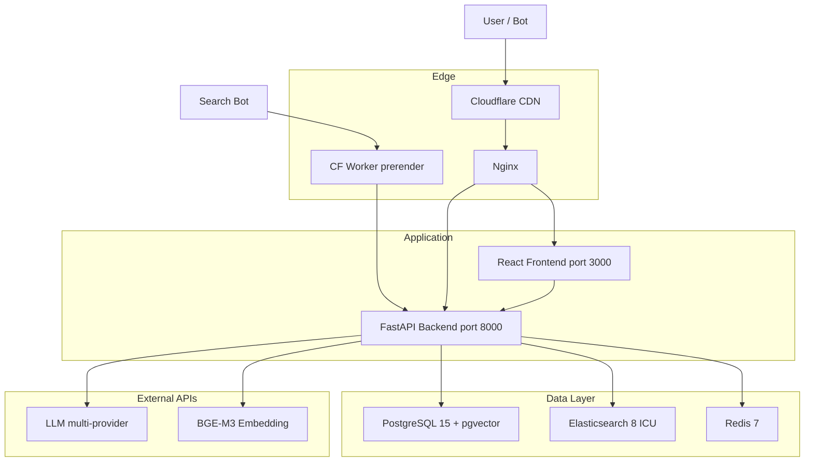
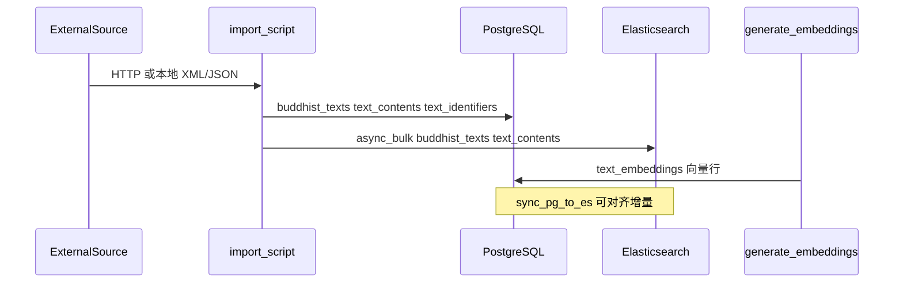

# FoJin（佛津）架构分析

> 本文档基于工作区内嵌套的 [`fojin/`](../fojin/) 仓库（上游：[github.com/xr843/fojin](https://github.com/xr843/fojin)）整理，供 jingxin（静心）团队理解其架构、数据流与存储设计，并做技术对照。文中规模数字以 FoJin 官方 README / DECISIONS 自述为准，**实际部署量取决于 importer 是否跑全**。

**文档版本：** 2026-06-03  
**分析范围：** 架构、数据来源、存储、核心链路；不含 FoJin 业务代码修改。

---

## 1. 项目概述

### 1.1 定位

FoJin 是**全球佛教数字文本聚合与研读平台**，目标是把分散在 CBETA、SuttaCentral、84000、BDRC、SAT、GRETIL、DILA 等数百个数据库中的典籍，统一到可检索、可阅读、可对读、可问答的单站体验。

| 维度 | 说明 |
|------|------|
| 经目规模 | 10,500+ 文本条目，8,900+ 含全文，23,500+ 卷 |
| 数据源 | 503 个登记数据源，30 种语言，30 国/地区 |
| 差异化能力 | LLM 验证的三藏段级对读、RAG 问答（小金）、知识图谱 + 地理地图、32 辞典、语义相似段落 |
| 许可 | Apache 2.0 |
| 线上 | [fojin.app](https://fojin.app) · [API 文档](https://fojin.app/docs) |

### 1.2 与 jingxin 的关系

- `fojin/` 在 jingxin 工作区内是**独立 Git 仓库**（`origin: https://github.com/xr843/fojin`），与 jingxin 主应用**无代码依赖**。
- **FoJin**：多源、万经、研究向、重基础设施（PG + ES + Redis + pgvector）。
- **jingxin**：少经深读、白话与 AI 解释、单机 SQLite、见 [静心设计规格](./superpowers/specs/2026-05-30-jingxin-reader-design.md)。

二者可互为参考（语料格式、CBETA 经号、RAG 引用结构），但不是同一产品线的上下游。

### 1.3 重要约束：仓库不含正文

克隆后 `docker compose up` 仅有 **schema + 数据源元数据**，无经文正文与向量。需按 README 执行 `import_catalog.py`、`import_content.py`、`generate_embeddings` 等脚本，从各源站或本地 xml-p5 拉取。

---

## 2. 目录与模块划分

```text
fojin/
├── frontend/                 # React 18 + Vite + Ant Design 5
│   └── src/
│       ├── pages/            # 路由页面（阅读、搜索、Chat、KG、Admin…）
│       ├── api/              # HTTP 客户端
│       ├── stores/           # Zustand（auth、timeline）
│       └── components/       # 搜索、KG 图、Deck.GL 地图、时间线等
├── backend/
│   ├── app/
│   │   ├── api/              # FastAPI 路由层
│   │   ├── models/           # SQLAlchemy ORM
│   │   ├── services/         # 业务逻辑（search、rag_retrieval、chat…）
│   │   └── core/             # ES 客户端、异常、限流
│   ├── alembic/versions/     # 120+ 数据库迁移
│   └── scripts/              # 导入/回填/审计（含 archive/）
├── workers/prerender/        # Cloudflare Worker：爬虫 SEO 预渲染
├── elasticsearch/            # 带 ICU 插件的 ES 镜像定义
├── docker-compose.yml        # 六服务编排
├── DECISIONS.md              # 架构决策记录（ADR）
└── docs/                     # 中英文 README、SEO、设计稿
```

**后端 API 分期注册**（见 `backend/app/main.py`）：

| 阶段 | 路由模块 | 能力 |
|------|----------|------|
| Phase 1 | auth, search, search_unified, texts, bookmarks, history | 认证、检索、经文、书签、历史 |
| Phase 2 | sources, relations, knowledge_graph, iiif, alignment | 数据源、关系、图谱、IIIF、跨藏对读 |
| Phase 3 | chat, share, og, annotations | AI 问答、分享、OG、批注 |
| 扩展 | dictionary, works, citations, exports, stats, feed, admin… | 辞典、FRBR、引用导出、统计、动态、管理 |
| SEO（无 `/api` 前缀） | sitemap, rss, seo, seo_persons, seo_dict | 站点地图、RSS、SSR 落地页 |

---

## 3. 系统架构

### 3.1 请求链路



### 3.2 Docker Compose 服务

定义于 [`fojin/docker-compose.yml`](../fojin/docker-compose.yml)：

| 服务 | 镜像/构建 | 内存限制 | 职责 |
|------|-----------|----------|------|
| `postgres` | `pgvector/pgvector:pg15` | 3g | 主库、向量、Umami 库 |
| `elasticsearch` | `./elasticsearch` 自建 | 1536m | 全文检索 |
| `redis` | `redis:7-alpine` | 256m | 限额与热点缓存 |
| `backend` | `./backend` | 1g | API + 脚本运行时 |
| `frontend` | `./frontend` | 128m | 构建后静态资源 |
| `umami` | ghcr.io/umami | 256m | 访问统计 |

持久卷：`pgdata`、`esdata`、`redisdata`。后端挂载 `./backend`（开发热更新）与 `./data`（如 CBETA `xml-p5`）。

生产典型路径：**Cloudflare → Nginx（gzip、安全头）→ 前端静态 / 后端 API**；内部端口绑定 `127.0.0.1`。

### 3.3 边缘与 SEO

[`fojin/workers/prerender/`](../fojin/workers/prerender/)：对 `/texts/:id` 识别爬虫 UA，调用后端 API 生成含真实 title/meta 的 HTML，避免 SPA 空壳被索引。

后端另有 `seo.py`、`seo_persons.py`、`seo_dict.py` 为人物、辞典词条等大批量实体提供 SSR 落地页。

---

## 4. 技术栈与架构决策（ADR）

完整记录见 [`fojin/DECISIONS.md`](../fojin/DECISIONS.md)。摘要如下：

| 层次 | 技术 | ADR 要点 |
|------|------|----------|
| 前端 | React 18, TypeScript, Vite, Ant Design 5, Zustand, TanStack Query, D3, Deck.GL + MapLibre | ADR-004：全局状态仅 auth/timeline，服务端数据走 Query |
| 后端 | FastAPI, SQLAlchemy 2.0 async, Pydantic v2, Alembic | ADR-005：全异步 ORM |
| 主库 | PostgreSQL 15 + pgvector + HNSW + pg_trgm | ADR-001：678K+ chunk 向量与业务同库 |
| 搜索 | Elasticsearch 8 + ICU | ADR-002：多语言分词与聚合 |
| 缓存 | Redis 7 选择性缓存 | ADR-009：匿名限额、统计缓存，非全站缓存 |
| AI | BGE-M3 embedding（ADR-007）+ 可选 cross-encoder 重排（ADR-006）+ 多厂商 LLM | SSE 流式（ADR-003） |
| 部署 | Docker Compose 单机（ADR-008） | 一条命令起全栈 |

---

## 5. 数据来源与采集管线

### 5.1 设计原则

1. **不将大体积正文打入 Git** — 合规与体积考虑，运行时从各源下载。
2. **Importer 幂等** — 普遍支持 `ON CONFLICT` / 可重复执行。
3. **双写检索** — 结构化数据入 PostgreSQL，检索副本入 Elasticsearch。

### 5.2 主要外部数据源

| 来源 | 内容类型 | 典型导入入口 |
|------|----------|--------------|
| [CBETA](https://www.cbeta.org/) | 汉文大藏、TEI xml-p5 | `scripts/import_catalog.py`、`import_content.py` |
| [DILA cbeta-metadata](https://github.com/DILA-edu/cbeta-metadata) | 经目 JSON | `import_catalog.py` 拉取 work_info |
| [SuttaCentral](https://suttacentral.net/) | 巴利/英等早期佛典 | `archive/imports/import_suttacentral.py` |
| [84000](https://read.84000.co/) | 藏传英译等 | `archive/imports/import_84000.py` |
| [DILA Authority](https://authority.dila.edu.tw/) | 人物/地点/经录 | `import_dila_authority.py`、`sync_dila_*.py` |
| [GRETIL](http://gretil.sub.uni-goettingen.de/) | 梵文电子文本 | `archive/imports/import_gretil.py` |
| 辞典（DPD、Monier-Williams、佛光等） | 词条 | `archive/imports/import_*.py` 数十个 |
| Wikidata / OSM / 高德 | 地理、寺庙、人物坐标 | `archive/fetch/`、`archive/enrich/` |

其余 400+ 源在 `data_sources` 表中登记，部分仅外链聚合（`access_type: external`），部分 `local` 含全文。

### 5.3 ETL 流程（典型）



**经目导入示例**（`import_catalog.py`）：

- 从 DILA `work-info/work_info.json` 或本地 `data/cbeta_all_works.json` 读取目录。
- 写入 `buddhist_texts`、`text_identifiers`，并 bulk 索引 ES `buddhist_texts`。

**全文导入示例**（`import_content.py`）：

- 解析 TEI xml-p5，写入 `text_contents`（按 `text_id`、`juan_num`、`lang` 唯一）。

**向量生成**（`archive/misc/generate_embeddings.py`）：

- 按 chunk 切分正文，调用 BGE-M3（OpenAI 兼容 API），写入 `text_embeddings`，依赖 pgvector HNSW 索引。

**维护脚本目录**：

- 活跃：`backend/scripts/import_*.py`、`sync_dila_combined.py` 等。
- 历史/一次性：`backend/scripts/archive/imports/`（50+）、`archive/backfill/`、`archive/enrich/`。

---

## 6. 存储模型

### 6.1 PostgreSQL（主数据）

逻辑域划分（表名见 `backend/app/models/`）：

| 域 | 核心表 | 说明 |
|----|--------|------|
| 数据源 | `data_sources`, `text_identifiers`, `source_distributions` | 503 源元数据、跨源 UID、地区/语种标签 |
| 经文 | `buddhist_texts`, `text_contents` | 经目 + 分卷正文；`cbeta_id` 唯一 |
| FRBR 作品层 | `works`, `work_witnesses`, `work_aliases` | 跨语言/跨藏抽象作品，不替代 `buddhist_texts` |
| 向量 / RAG | `text_embeddings` | `embedding vector(1024)`（迁移中亦有 1536 历史）；HNSW 余弦检索 |
| 跨藏对读 | `alignment_pairs` | chunk 级 lzh/pi/bo 对齐，供对读页与 parallel RAG |
| 知识图谱 | `kg_entities`, `kg_relations` | 人物、寺院、概念、师承等；含 `source_tier` 溯源字段 |
| 辞典 | `dictionaries`, `dictionary_entries` | 多辞典、多语种词条 |
| 用户 | `users`, `bookmarks`, `annotations`, `reading_history` | JWT；书签、批注、阅读历史 |
| 对话 | `chat_sessions`, `chat_messages`, `chat_attachments` | AI 会话；支持 BYOK 加密 API Key |
| 运营 | `feed_items`, `source_suggestions`, `feedbacks`, `audit_log` | 动态流、源建议、反馈、管理审计 |

**经文实体要点**（`BuddhistText`）：

- 多语标题：`title_zh`、`title_en`、`title_sa`、`title_bo`、`title_pi`
- 关联：`source_id`、`lang`（默认 `lzh`）、`has_content`、`content_char_count`
- 与 `TextContent` 一对多：按卷 `juan_num` 存 `content` / `content_html`

### 6.2 Elasticsearch（检索副本）

索引名（`app/core/elasticsearch.py`）：

| 索引 | 用途 |
|------|------|
| `buddhist_texts` | 经目检索：标题、译者、朝代、分类、源等 |
| `text_contents` | 全文检索：经文 body，CJK ICU 分析器 |

搜索服务（`app/services/search.py`）对两索引分别查询，支持高亮、折叠（collapse by text_id）、聚合 facet。

### 6.3 Redis（缓存与限额）

非全站缓存，典型用途：

- 匿名用户 AI 问答：**按 IP 日限额**（24h TTL）
- 管理后台 `overview` / `trends` 统计
- 辞典 sources 列表等读多写少接口

### 6.4 文件与挂载

- Compose 卷 `pgdata` / `esdata` / `redisdata`
- 后端 `./data`：本地 `xml-p5`、`cbeta_all_works.json` 等导入输入

---

## 7. 核心功能数据流

### 7.1 多维检索

```text
用户查询 → /api/search 或 /api/search/unified
         → search.py
         → ES: buddhist_texts（经目）+ text_contents（全文）
         → 可选：pgvector 语义卡片 / 外部源卡片
```

限流：搜索 60/min，全文 30/min（见 OpenAPI 说明）。

### 7.2 在线阅读与相似段

```text
/texts/{id} → texts API → PG text_contents
阅读页侧边栏 → embedding.similarity_search（同经或跨经 cosine Top-K）
```

### 7.3 AI 问答（RAG + SSE）

```text
POST /api/chat/stream
  → chat._prepare_chat
  → rag_retrieval.retrieve_rag_context
       1. 精确经卷短路（《经名》第 N 卷 → text_contents 直查）
       2. BGE-M3 嵌入 → pgvector HNSW Top-K
       3. 三语 parallel 模式（可选）：lzh/pi/bo 分路检索 + alignment 合并
       4. 重排：关键词默认；配置 RERANKER_API_URL 时用 cross-encoder
       5. 取 Top 5 chunks 拼 context
  → LLM 流式 SSE（2KB padding 冲刷 CDN 缓冲）
  → 落库 chat_messages + 返回 citations
```

**法师模式**：`master_profiles` 限定 `scope_text_ids`，RAG 仅在法师核心典籍范围内检索。

### 7.4 三语跨藏对读

- 数据：`alignment_pairs`（LLM 验证的 chunk 对齐）
- API：`/api/alignment/*`
- 阅读：`ParallelReaderPage`；RAG 中 `ENABLE_PARALLEL_RAG` 与 alignment 联动

### 7.5 知识图谱与地图

- 图数据：`kg_entities` / `kg_relations`（含 DILA 师承链）
- API：`knowledge_graph.py` — 力导向图、邻居遍历
- 地图：地理坐标属性 + Deck.GL 渲染（`KGMapPage`）

---

## 8. 前端架构要点

| 项 | 说明 |
|----|------|
| 构建 | Vite 5，`tsc -b && vite build` |
| UI | Ant Design 5 + 自定义 CSS 模块（reader、kg、timeline 等） |
| 路由 | React Router；页面见 `frontend/src/pages/` |
| 数据获取 | `@tanstack/react-query` + `api/client.ts`（axios） |
| 国际化 | i18next，9 种 UI 语言 |
| 简繁 | opencc-js |
| 地图 | deck.gl + maplibre-gl |
| 手稿 | openseadragon（IIIF） |
| 测试 | Vitest 单元 + Playwright E2E |

主要页面与能力对应：

- `SearchPage` / `UnifiedResults` — 统一搜索结果
- `TextReaderPage` / `TextDetailPage` — CBETA 风格阅读
- `ParallelReaderPage` — 多语对读
- `ChatPage` — 小金 AI
- `KnowledgeGraphPage` / `KGMapPage` — 图谱与地理
- `DictionaryPage` — 辞典
- `TimelinePage` / `DashboardPage` — 统计可视化
- `Admin*Page` — 用户、批注、审计、建议

---

## 9. 与 jingxin（静心）对照

基于 [静心读者设计规格](./superpowers/specs/2026-05-30-jingxin-reader-design.md) 与 FoJin README。

| 维度 | FoJin | jingxin |
|------|-------|---------|
| 产品一句话 | 全球佛教数字文献聚合与研读 | 现代化佛经阅读与理解（非数据库） |
| 目标用户 | 研究者、多传统读者 | 普通人、初学者、爱好者 |
| 经目规模 | 万级、503 源 | MVP 约 12 经，语料在 `chinese-sutras-md` / corpus-v3 |
| 数据库 | PostgreSQL + ES + Redis + pgvector | SQLite 单文件 + FTS5 |
| 部署 | Docker Compose 多容器 | 单机 VPS + pm2 + `data/jingxin.db` |
| 全文搜索 | Elasticsearch ICU | SQLite FTS5 |
| AI | 内置 RAG、多模型、8 法师人格、BYOK | Gateway 段落解释；第三版规划「问经」 |
| 对读 / 图谱 / 辞典 | 核心能力 | 规格明确两年内不做 Neo4j/ES/社区 |
| 语料管线 | 运行时 importer 拉远程 | 本地 Markdown + meta.yaml + 导入脚本 |
| 版权/源 | 多源多许可（CBETA CC BY-NC-SA 等） | 以 CBETA 为主，corpus 目录规范自建 |

### 9.1 jingxin 可借鉴的设计点（非实施承诺）

1. **经卷精确检索短路** — 用户点名《XX经》第 N 卷时直查 `text_contents`，避免向量误召回（`precise_retrieval.py`）。
2. **FRBR `works` 层** — 同一经典多译本/多藏编号时，用 `works` + `work_witnesses` 聚合展示。
3. **引用与 citation 结构** — Chat 返回可点击 `ChatSource`（text_id、juan、chunk），利于学术可追溯。
4. **双写检索** — 结构化在 SQL，检索在专用引擎；jingxin 若经目上万可评估 Meilisearch/ES，但 MVP 坚持 FTS5。
5. **OpenCC 简繁** — 检索与地图筛选已验证的模式。
6. **Importer 幂等与溯源** — `source_tier`、`ingested_at` 等字段便于语料审计（与 jingxin `meta.yaml` 溯源理念一致）。

### 9.2 不建议 jingxin 直接照搬的部分

- 六容器 Compose 与 ES/pgvector 运维成本，与静心「单机 SQLite」战略冲突。
- 503 源外链聚合的产品复杂度，与「少经深读」定位不符。
- 全库 embedding 流水线成本，MVP 阶段可用 FTS + 小范围向量或纯 Gateway。

---

## 10. 数据复用策略（辞典与 KG）

静心 **不** 从 fojin.app 下载全文或图谱 bulk 导出；辞典与知识图谱与 FoJin **同源上游**，在 jingxin 用 TypeScript 重写 importer，真相源落在 `chinese-sutras-md/辞典/` 与 `chinese-sutras-md/知识图谱/`。

| 能力 | FoJin 参考 | jingxin 实现 |
|------|------------|--------------|
| 辞典 TEI | `import_dila_dict.py`、各 `import_*.py` | `dict:import:dila`、`lib/dictionaries/*` |
| NTI TSV | `import_nti_dict.py` | `dict:import:dila --source nti` |
| 人物 RDF | `sync_dila_combined.py` | `kg:import:dila` |
| 经目/译者 | `extract_structured_kg.py` Pass A/B | `kg:extract:corpus` |
| 经间关系 | Pass C–F / 题名规则 | `kg:extract:cbeta-notes`（轻量） |
| 存储 | PostgreSQL + ES | **SQLite FTS + JSONL 真相源** |

设计规格见 [2026-06-03-buddhist-dict-kg-design.md](./superpowers/specs/2026-06-03-buddhist-dict-kg-design.md)。许可逐源记入 `catalog.yaml`，对齐 FoJin `NOTICE` 思路。

---

## 11. 测试、运维与配置

### 11.1 CI

- [`fojin/.github/workflows/ci.yml`](../fojin/.github/workflows/ci.yml) — lint、测试
- [`security.yml`](../fojin/.github/workflows/security.yml) — 安全扫描
- [`alembic-dry-run.yml`](../fojin/.github/workflows/alembic-dry-run.yml) — 迁移干跑

后端测试在无 live Postgres 时用 mock/fixture 模式（见 `tests/test_works_api.py` 注释）。

### 11.2 配置要点（`.env`）

| 变量 | 用途 |
|------|------|
| `POSTGRES_PASSWORD` | 数据库（必填） |
| `JWT_SECRET_KEY` | 用户会话 |
| `API_KEY_ENCRYPTION_KEY` | BYOK Fernet 加密 |
| `LLM_API_*` / `EMBEDDING_API_*` | AI 与向量 |
| `RERANKER_API_*` | 可选交叉编码器重排 |
| `FOJIN_ENV` | production 下配置校验 |

### 11.3 本地快速启动

```bash
cd fojin
cp .env.example .env   # 编辑密码与密钥
docker compose up -d
# 前端 http://localhost:3000  后端 http://localhost:8000/docs
```

导入正文（示例）：

```bash
docker exec fojin-backend python scripts/import_catalog.py
docker exec fojin-backend python scripts/import_content.py --all --xml-dir /data/xml-p5
docker exec fojin-backend python -m scripts.archive.misc.generate_embeddings --source cbeta
```

---

## 附录 A：API 路由一览

前缀 `/api`（除非注明）：

- **检索**：`search`, `search/unified`
- **经文**：`texts`, `works`
- **用户**：`auth`, `bookmarks`, `history`, `annotations`
- **AI**：`chat`
- **数据**：`sources`, `dictionary`, `alignment`, `knowledge_graph`, `relations`, `iiif`
- **运营**：`stats`, `feed`, `admin`, `feedback`, `source-suggestions`, `notification`
- **其它**：`citations`, `exports`, `share`, `og`
- **根路径 SEO**：`/sitemap.xml`, RSS, `/texts/{id}` SSR 等

---

## 附录 B：进一步阅读

| 文档 | 路径 |
|------|------|
| 英文 README | [fojin/README.md](../fojin/README.md) |
| 中文 README | [fojin/docs/README_zh.md](../fojin/docs/README_zh.md) |
| 架构决策 ADR | [fojin/DECISIONS.md](../fojin/DECISIONS.md) |
| SEO 部署 | [fojin/docs/SEO_SETUP.md](../fojin/docs/SEO_SETUP.md) |
| 静心设计规格 | [docs/superpowers/specs/2026-05-30-jingxin-reader-design.md](./superpowers/specs/2026-05-30-jingxin-reader-design.md) |
| FRBR Works 审计 | [fojin/docs/superpowers/plans/2026-06-01-frbr-works-quality-audit.md](../fojin/docs/superpowers/plans/2026-06-01-frbr-works-quality-audit.md) |

---

*本文档由 jingxin 仓库维护，FoJin 上游更新后请酌情重新核对 importer 路径与规模数字。*
