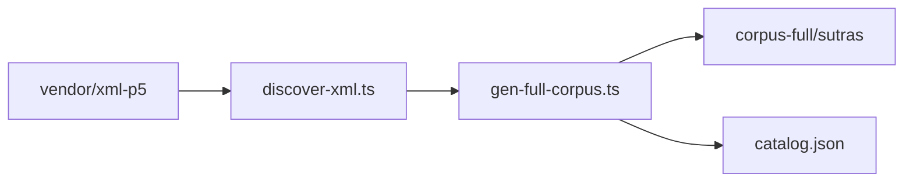

# jingxin 全藏 Markdown 生成（八期 A 阶段）

**日期：** 2026-05-31  
**作者：** jingxin  
**状态：** 已批准（用户确认「可以」）

---

## 1. 目标

从本地完整 `vendor/xml-p5`（约 **5005** 个 `*.xml`）生成与现 MVP 格式一致的 **Markdown 语料**，含 frontmatter、`## 原文`、**空 `## 白话`**，长经按现有分片规则拆分。

**本期只做 MD 生成**，不做：SQLite 导入、FTS、白话 batch、阅读器全藏、git 提交生成物。

## 2. 用户约束（已确认）

| 项 | 决定 |
|----|------|
| 范围 | 扫描 xml-p5 下 **全部** `*.xml` |
| 存放 | `corpus-full/`，**不提交 git**（`.gitignore`） |
| 白话 | 保留 `## 白话` 结构，**内容留空** |
| MVP | 现有 `corpus/sutras/` + `MVP_CANON` **不变** |

## 3. 架构



- **发现层：** 递归收集 XML，从文件名解析 `cbetaId`。
- **生成层：** 复用 `parseCbetaFile`、`groupParagraphs`、`serializeCorpusMarkdown`（与 [`scripts/gen-cbeta-markdown.ts`](../../../scripts/gen-cbeta-markdown.ts) 同源逻辑，抽取共享或调用）。
- **索引层：** `corpus-full/catalog.json` 记录每经 `status`、`files`、`paragraphCount`、`title`。

## 4. 目录布局

```
corpus-full/                 # .gitignore
  README.md                  # 生成说明（可提交 git）
  catalog.json
  sutras/
    t08n0251/                # slug = cbetaId 小写
      000-00.md
  logs/
    gen-errors.jsonl
corpus/sutras/               # MVP 11 经，逻辑不变
```

## 5. slug 与 frontmatter

- **slug：** `cbetaId.toLowerCase()`（如 `T08n0251` → `t08n0251`）；冲突在 catalog 记 `slug` 加后缀。
- **frontmatter：** `cbeta_id`、`slug`、`title`、`translator?`、`category?`（可从 series 推导或留空）、`chapter_seq`、`source_xml`、`generated_at`。
- **分片：** 与 MVP 相同：`MAX_PARAS_PER_FILE=200`，`MAX_CHARS_PER_FILE=80000`；`--clean-stale` 按 slug 目录清理陈旧分片。

## 6. CLI

| 命令 | 说明 |
|------|------|
| `npm run corpus:gen:full` | 全量生成 |
| `--limit N` | 仅处理前 N 部（试跑） |
| `--resume` | 跳过 catalog 中 `status=ok` |
| `--slug t08n0251` | 单经 |
| `--clean-stale` | 删除该 slug 下未再生的 md |

环境变量：

- `CBETA_XML_DIR`（默认 `vendor/xml-p5`）
- `CORPUS_FULL_DIR`（默认 `corpus-full`）

## 7. 错误处理

- 单经失败不中断；写入 `logs/gen-errors.jsonl`。
- `catalog.json` 条目：`status`: `ok` | `error` | `skipped`（无正文等）。
- 每 50 部打印进度。

## 8. 体量与运行

- 11 经 MVP 语料约 **1.1MB**；全藏预估 **数百 MB～数 GB**（视分片而定）。
- 首次全量建议本机执行数小时；**CI 仅** `--limit 3` 烟雾测试。

## 9. 与 MVP / 七期的关系

| 路径 | 用途 |
|------|------|
| `corpus/sutras/` | 站点 MVP、`corpus:import`、`corpus:refresh` |
| `corpus-full/sutras/` | 全藏 MD 真相源；**八期 B** 再议 `import:full` |

同一 `cbetaId` 若两处皆有，**站点仍以 MVP 目录为准**，直至全藏导入阶段切换策略。

## 10. 测试

- 单元：`discover-xml` 在 fixture 子集计数、cbetaId 解析。
- 集成：`corpus:gen:full --limit 3` 产出 md + catalog 片段。
- 不将 `corpus-full/sutras/**` 纳入默认 `npm test` 全量扫描（避免 CI 超时）。

## 11. 成功标准

1. 本地 `npm run corpus:gen:full` 完成，`catalog.json` 中 `ok` + `skipped` + `error` 合计覆盖全部发现 XML。
2. 抽样 md 格式与 `corpus/sutras/xinjing.md` 一致，含空 `## 白话`。
3. `corpus-full/sutras/` 不在 git 跟踪；`npm test`（MVP）仍通过。

## 12. 明确不做（本期）

- `corpus:import` 全藏入库
- `colloquial:batch` 全藏
- 扩 `MVP_CANON` 或改首页为全藏目录
- 将 `corpus-full` 提交 git

## 13. 后续（八期 B+，另立 spec）

- `corpus:import:full` + FTS 分区/增量
- 热门经白话策略（按需 / 仅 MVP 映射）
- 经目浏览 UI
