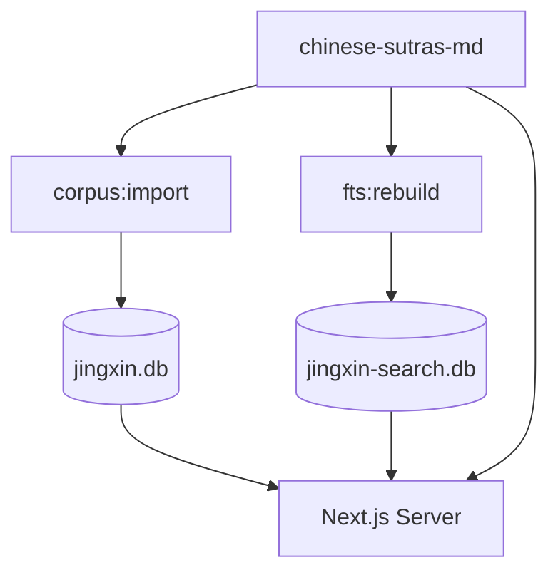

# 数据库激进瘦身：正文外置 + 检索分库

**日期**：2026-06-04  
**状态**：已实施

## 目标

- `data/jingxin.db`（主库）&lt; 500MB：仅存经目、段落身份、辞典、KG、用户数据
- `data/jingxin-search.db`（检索库）~2.5GB：`paragraph_fts` 全文索引
- `chinese-sutras-md/简体/`：正文真相源

## 架构

## 运维命令

| 命令 | 说明 |
|------|------|
| `npm run db:stats` | 主库 / 检索库体积、碎片、FTS 行数 |
| `npm run db:migrate` | 建表（新库为瘦身 schema + 空检索库） |
| `npm run db:migrate:slim` | 已有库：去 `paragraph.text`、删主库 FTS、`VACUUM` |
| `npm run corpus:import` | 只写段落身份（瘦身后） |
| `npm run fts:rebuild` | 从语料 MD 写入 `jingxin-search.db` |
| `npm run data:health -- --strict` | 含检索库存在性检查 |

## 部署约束

- VPS 必须挂载 `CORPUS_DIR`（默认 `chinese-sutras-md`）
- 无语料时阅读页段落正文为空；`data:health --strict` 会失败

## 代码入口

- 正文：`lib/corpus-v3/read-paragraph.ts`
- 查询：`lib/sutra/queries.ts`（hydrate）
- 检索：`lib/search/fts.ts`、`lib/reader/similar.ts` → `getSearchSqlite()`
