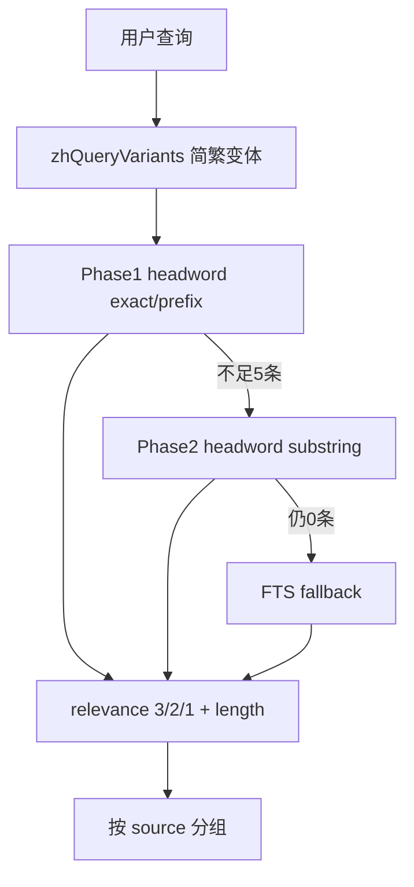

# 辞典搜索对齐 fojin 设计

**日期**：2026-06-04  
**状态**：已实施

## 目标

搜索「般若」等词条时：

1. 精确 headword 优先于前缀/子串命中
2. 仅搜索 headword（主路径），definition FTS 作兜底
3. 结果按辞典来源分组展示
4. 统一搜索/阅读器轮询多来源，避免单一辞典占满

## 检索语义

## 代码入口

| 模块 | 路径 |
|------|------|
| 排序工具 | `lib/dictionaries/lookup-rank.ts` |
| 查询 | `lib/db/dict-kg.ts` |
| 分组 API | `GET /api/dictionary/lookup/grouped` |
| 扁平 API | `GET /api/dictionary/lookup`（兼容） |
| 来源排序 | `lib/dictionaries/sources.ts` `SOURCE_SORT_ORDER` |

## 默认导入来源

`ZH_DILA_SOURCE_CODES`: `dingfubao`, `nanshanlu`, `nti`

导入：`npm run dict:import:all-han && npm run dict:import:sqlite`

## 验收

- `/dictionary?q=般若`：各组内「般若」排第一
- 分组标题含来源名与条数
- `/search?q=般若` 辞典区多来源各有代表
- 阅读器划选辞典 Tab 按来源展示
