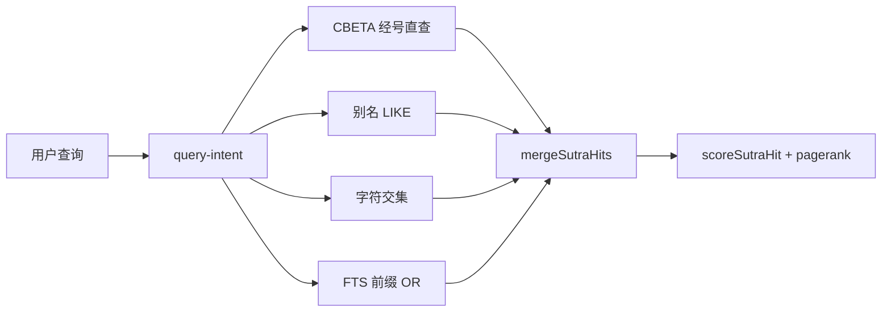

# 搜索质量设计（fojin + CBETA，SQLite）

**日期**：2026-06-04  
**作者**：jingxin

## 背景

用户搜索「金刚经」时，经目区常为空或命中科仪/灵验记，而非正典 `T08n0235`。根因：

1. `sutra_fts` 使用 `unicode61` 分词，中文短语 `"金刚经"` 零命中
2. 无简称 → 全名别名（fojin ABBREV）
3. 无正典排序（CBETA `pagerank.txt`）

## 方案

在保持 SQLite/FTS5 前提下，三层叠加：

| 层 | 来源 | 模块 |
|----|------|------|
| 别名 | fojin | `lib/search/sutra-aliases.ts` |
| 经目字符交集 | CBETA `libhan.py Search` | `lib/search/title-index.ts` |
| 正典排序 | CBETA `idx/pagerank.txt` | `data/sutra-pagerank.json` + `lib/search/sutra-pagerank.ts` |

## 检索流程

## 段落检索

- FTS 查询：CJK 按字 `AND`（`fts-query.ts`）
- 排序：`wordcount`（snippet 原文命中次数）+ `sutraRankHint`（经目 top hits）+ `pagerank`

## 数据文件

- `npm run search:build-pagerank` 从 `cbeta/idx/pagerank.txt` 生成 `data/sutra-pagerank.json`
- `npm run fts:rebuild` 经目 FTS title 字段附加 alias

## 验收

- `/search?q=金刚经` 经目首条 `T08n0235`
- `/search?q=T08n0235` 直查
- `/search?q=心经|法华经` 命中 pagerank 顶部经目
- `npm test tests/search/` 通过
